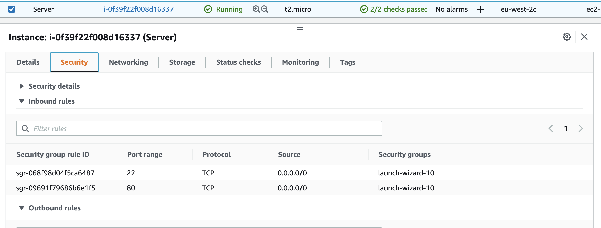
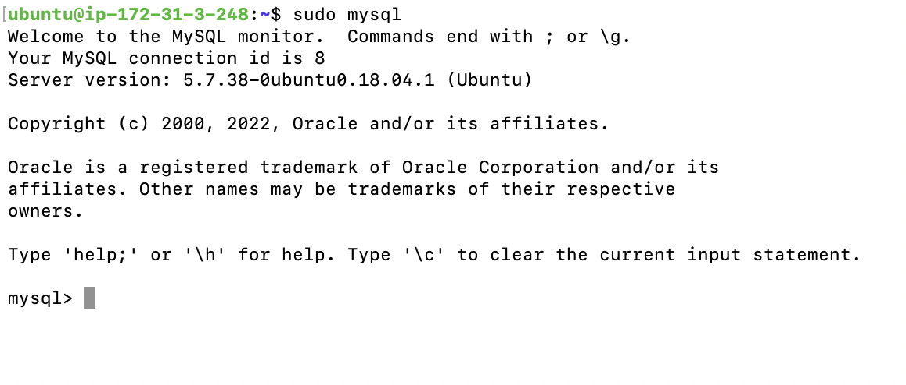
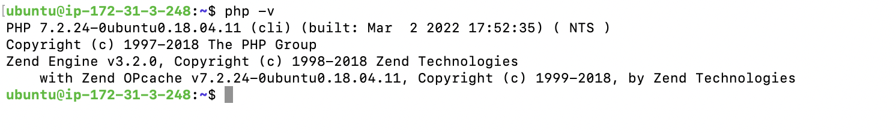

# Aker-Systems-Project-1-LAMP-stack-implementation

## Intro

In this project, I will employ a LAMP (Linux, Apache, MySQL, PHP) stack project in an amazon EC2 instance. Here are the steps I took to implement this.


### Initial Amazon EC2 Spin-Up & Appache Installation.

- Firstly, I used my aws account free tier to spin up an ec2 with ubuntu 18:0 as the OS. Furthermore, I changed the inbound security group to allow http, to later see the output on the web.
<<<<<<< HEAD
- the following commmand was run `sudo apt update && sudo apt install apache2 && sudo systemctl status apache2` to install and check apache's status.
=======
- the following commmand was run `sudo apt update && sudo apt install apache2 && sudo systemctl status apache2` to update, install and check apache's status.
- Afterwhich, all was well and was visible via http://<EC2 public IP>:80.
>>>>>>> development




<<<<<<< HEAD
=======

### Installation Of MySQL

- Installation of MySQL was carried out via `sudo apt install mysql-server`.
- To test if the install was successful or not, i ran `sudo mysql`. This can be seen in the image below




### Installation Of PHP

- PHP was installed and checked via `sudo apt install php libapache2-mod-php php-mysql`, and `php -v` respectively.




### Creating a virtual Host for website using Apache

- Firstly a directory was made for my project in /var/www/html as this is were apache is configured to serve documents. `sudo mkdir /var/www/projectlamp` was run.
- I next assigned ownership to the current system user. ` sudo chown -R $USER:$USER /var/www/projectlamp`.
- A configuration file was created in apache's 'sites available'. `sudo vi /etc/apache2/sites-available/projectlamp.conf`.
the following file was populated with the code below.

- The virtual host was initiated via `sudo a2ensite projectlamp`, and the default was disabled via `sudo apache2ctl configtest`.
- I then reloaded apache to allow new changes to take affect `sudo systemctl reload apache2`.

- Finally I created and populated an index.html file in the new project directory to be served to the front-end. `sudo echo 'Hello LAMP from hostname' $(curl -s http://169.254.169.254/latest/meta-data/public-hostname) 'with public IP' $(curl -s http://169.254.169.254/latest/meta-data/public-ipv4) > /var/www/projectlamp/index.html`

```
# Configuration file

<VirtualHost *:80>
    ServerName projectlamp
    ServerAlias www.projectlamp 
    ServerAdmin webmaster@localhost
    DocumentRoot /var/www/projectlamp
    ErrorLog ${APACHE_LOG_DIR}/error.log
    CustomLog ${APACHE_LOG_DIR}/access.log combined
</VirtualHost>

```


### Enabling PHP 

- Firstly, I altered the default DirectoryIndex settings on apache to prioritise .php files over html. This was done via `sudo vim /etc/apache2/mods-enabled/dir.conf`, where I changed the order to the following 'DirectoryIndex index.php index.html index.cgi index.pl index.xhtml index.htm'. A reload was initiated to this new change was in affect via `sudo systemctl reload apache2`.


- I created a new file isung vim called index.php through `vim /var/www/projectlamp/index.php` , and inside I placed the follwoing below.


```

<?php
phpinfo();

```

- The final result is the website below with all the information about the server.


>>>>>>> development
NEW LINE TEST